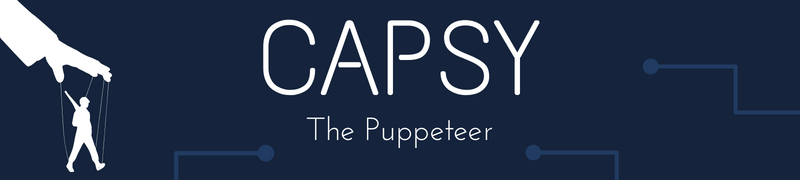
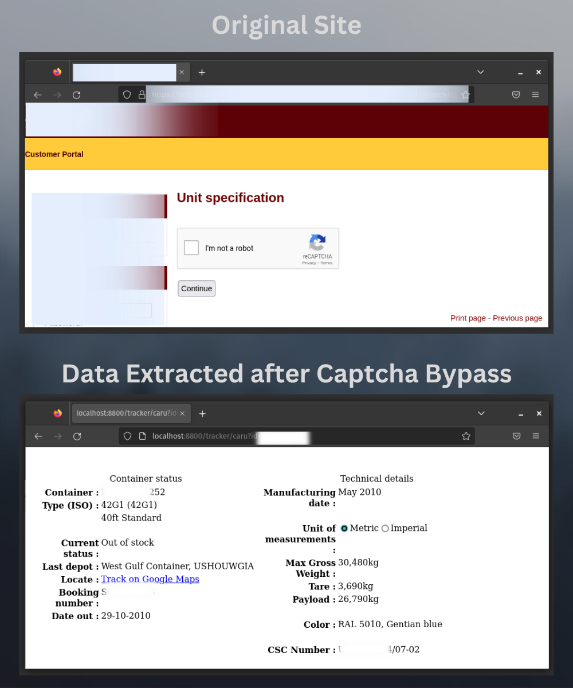

# Capsy the Puppeteer



This is a simple project to demonstrate how to use [Puppeteer](https://pptr.dev/) to extract data from a website that is protected by reCaptcha. It uses a headless browser provided by Puppeteer to load the page. To solve the reCaptcha, it uses a service called [2Captcha](https://2captcha.com/). The service provides an API that can be used to solve the reCaptcha.

## Requirements

The project requires the following to be installed:

- [Node.js](https://nodejs.org/en/)
- [Docker](https://www.docker.com/)
- [Docker Compose](https://docs.docker.com/compose/)

It also requires a [2Captcha](https://2captcha.com/) API key.

### Installation

After installing the requirements, clone the repository and install the dependencies:

```bash
git clone https://github.com/arman-bd/capsy-the-puppeteer.git
cd capsy-the-puppeteer
npm install
```

### Configuration

The configuration is done in the `.env` file. The following environment variables are required:

- `CAPTCHA_API_KEY`: The API key for 2Captcha
- `CAPTCHA_API_URL`: The API URL for 2Captcha

Copy the `.env.example` file to `.env` by running the following command:

```bash
cp .env.example .env
```

Now, you can edit the `.env` file and fill in the values.

### Running

You can run the project in development mode by running the following command:

```bash
npm run dev
```

This will start the server on port 8800. You can access the API at `http://localhost:8800`.

### Running using Docker Compose

You can also run the project using Docker. To do so, run the following command:

```bash
docker-compose up --build -d
```

The command will build the Docker image and start the container in detached mode. 
You can access the API at `http://localhost:8800`.

### API

The application currently has the following API(s):

- `GET /`: Returns a simple message to indicate that the API is working.
- `GET /ping`: Returns a ping response with Timestamp.
- `GET /task/screenshot?url={url}`: Returns a screenshot of the given URL.
- `GET /track/caru?id={id}`: Returns the tracking information for the given Caru Container ID.

### How it works

The project uses Puppeteer to load the page and solve the reCaptcha. The following steps are performed for Caru Container Tracking API:

1. The page is loaded using Puppeteer.
2. Waits for the page to load.
3. Checks if the reCaptcha is present.
4. Asks 2Captcha to solve the reCaptcha.
5. Places the solution in the reCaptcha field.
6. Clicks the "Continue" button.
7. Waits for the next page to load.
8. Places the Container ID in the field.
9. Submits the form.
10. Waits for the page to load.
11. Extracts the tracking information.
12. Returns the tracking information via the API.

### Capsy in Action



**Note:** Some of the information is hidden in the screenshot for privacy reasons. Please keep in mind that this is a demo project and should not be used in production & it's for educational purposes only.

## License

This project is licensed under the MIT License - see the [LICENSE](LICENSE) file for details.

## Disclaimer

This project is for educational purposes only. It is not intended to be used for any production purposes. The author is not responsible for any misuse or damage caused by this project. Use it at your own risk.

## References

- [Node.js](https://nodejs.org/en/)
- [TypeScript](https://www.typescriptlang.org/)
- [Express](https://expressjs.com/)
- [Docker](https://www.docker.com/)
- [Docker Compose](https://docs.docker.com/compose/)
- [Puppeteer](https://pptr.dev/)
- [2Captcha](https://2captcha.com/)
